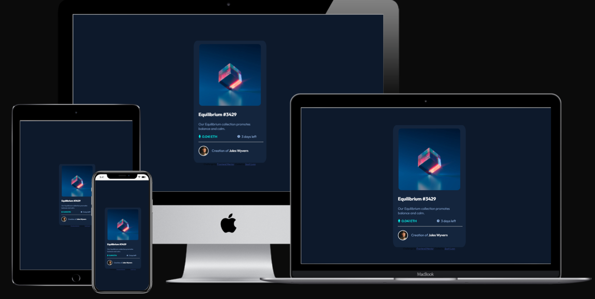
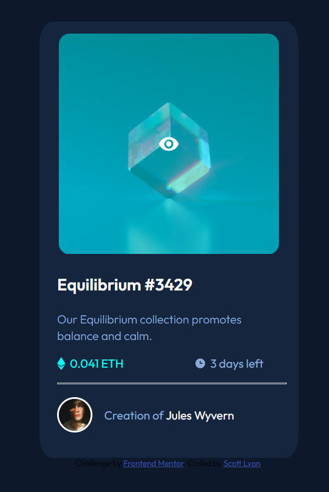
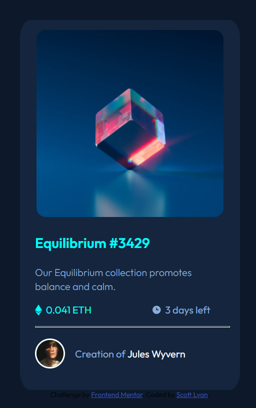
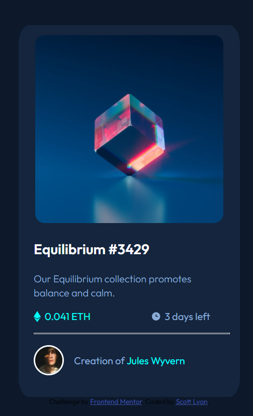

# Frontend Mentor - NFT preview card component solution

This is a solution to the [NFT preview card component challenge on Frontend Mentor](https://www.frontendmentor.io/challenges/nft-preview-card-component-SbdUL_w0U).

## Table of contents

-   [Overview](#overview)
    -   [The challenge](#the-challenge)
    -   [Screenshot](#screenshot)
    -   [Links](#links)
-   [My process](#my-process)
    -   [Built with](#built-with)
    -   [What I learned](#what-i-learned)
    -   [Continued development](#continued-development)
    -   [Useful resources](#useful-resources)
-   [Author](#author)
-   [Acknowledgments](#acknowledgments)

## Overview

### The challenge

Users should be able to:

-   View the optimal layout depending on their device's screen size
-   See hover states for interactive elements

### Screenshot

### Links

-   Solution URL: [GitHub](https://github.com/TotallySly/nft-preview-card--frontend-mentor--html-css)
-   Live Site URL: [NFT Preview Card](https://totallysly.github.io/nft-preview-card--frontend-mentor--html-css/)

## My process

### Built with

-   Semantic HTML5 markup
-   CSS custom properties
-   Flexbox
-   CSS Grid
-   Mobile-first workflow

### What I learned

I learnt the power of using max-width when setting container 'divs'. This has helped maintain a solid structure, allowing the content of remain consistent throughout. I am yet to make a responsive design as of yet. So I am curious to see if this helps and will allow less Media Queries.

It took me a long time to figure out how to do the Overlay for the Logo. Sadly I cannot take complete success of coming up with the solution by myself. I had to look at several different solutions and I adapted them to fit my code.

Using rem for sizing of containers and elements.

### Continued development

Position Absolute and Relative. I made a naive assumption that this was not used that much due to Flexbox and Grid. So I need to place more time in learning exactly how this works.

I should use :root and var to establish my colour schemes. It is repetitive to constantly type out each colour, even with the Emmet snippet that is displayed within VS Code.

Look more into transitions and transform(X) and (Y).

### Useful resources

-   [Overlay](https://stackoverflow.com/questions/9724035/how-can-one-create-an-overlay-in-css) - This provided a simple solution to the theory behind creating an Overlay.
-   [Overlay](https://dev.to/ellen_dev/two-ways-to-achieve-an-image-colour-overlay-with-css-eio) - Again, provided a simple solution to the theory behind creating an Overlay

## Author

-   Frontend Mentor - [@TotallySly](https://www.frontendmentor.io/profile/TotallySly)
-   Twitter - [@DizzySloth](https://www.twitter.com/DizzySloth)

## Acknowledgments

Various users of Frontend Mentor who struggled before me in solving this challenge and for me to adapt different code for my situation.
